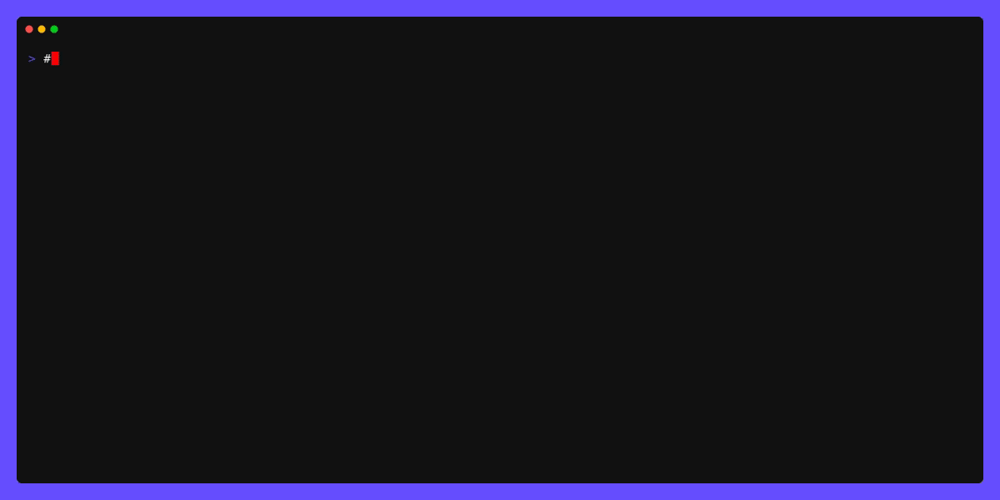

<!-- markdownlint-disable -->
# Geodesic - The Ultimate DevOps Toolbox Image

 [](https://github.com/cloudposse/geodesic/actions?query=workflow%3Adocker) [](https://github.com/cloudposse/geodesic/releases/latest) [](https://slack.cloudposse.com) [](https://archive.sweetops.com/geodesic)
<!-- markdownlint-restore -->

[![README Header][readme_header_img]][readme_header_link]

[![Cloud Posse][logo]](https://cpco.io/homepage)

<!--


  ** DO NOT EDIT THIS FILE
  **
  ** This file was automatically generated by the `build-harness`.
  ** 1) Make all changes to `README.yaml`
  ** 2) Run `make init` (you only need to do this once)
  ** 3) Run`make readme` to rebuild this file.
  **
  ** (We maintain HUNDREDS of open source projects. This is how we maintain our sanity.)
  **


-->

Geodesic is a robust Linux toolbox container, crafted to optimize DevOps workflows. This container comes fully loaded with all essential dependencies for a complete DevOps toolchain. It's designed to bring consistency and boost efficiency across development environments. It achieves this without the need for installing additional software on your workstation. Think of Geodesic as a containerized parallel to Vagrant, offering similar functionality within a Docker container context.  

## Key Features

- **Unified Toolchain**: By packaging all necessary DevOps tools and dependencies, Geodesic eliminates the "works on my machine" problem, ensuring toolchain uniformity across different machines.
- **Consistent Environment**: Geodesic guarantees that every developer operates in a uniform OS environment with consistent tool versions, sidestepping discrepancies that often arise in diverse development setups.
- **Quick Start for New Developers**: It streamlines the onboarding process for new team members, allowing them to bypass lengthy workstation configurations and dive straight into productivity.
- **Cross-Platform Compatibility**: With native support for Mac OSX, Linux, and [Windows (via WSL)](https://docs.microsoft.com/en-us/windows/wsl/install-win10), Geodesic extends its versatile toolchain to a wide range of operating systems, ensuring broad accessibility and functionality.
- **Version Control for Tools**: Geodesic facilitates easy versioning of tools for different environments, enabling repeatable setups and minimizing compatibility issues.
- **Reusable Base Image for Toolboxes**: Empower teams to create and maintain consistent toolbox images, ensuring a standardized development environment across the board.

---

This project is part of our comprehensive ["SweetOps"](https://cpco.io/sweetops) approach towards DevOps.


It's 100% Open Source and licensed under the [APACHE2](LICENSE).


## Screenshots



*<br/>Example of running a shell based on the `cloudposse/geodesic` base docker image.*


## Introduction

These days, the typical software application is distributed as a docker image and run as a container. Why should infrastructure be any different? Since everything we write is "Infrastructure as Code", we believe that it should be treated the same way. This is the "Geodesic Way". Use containers+envs instead of unconventional wrappers, complicated folder structures and symlink hacks. Geodesic is the container for all your infrastructure automation needs that enables you to truly achieve SweetOps.

Geodesic is best used in one of these two ways:

  1. **Interactive Shell** It is optimized to work as an interactive command-line shell. The shell includes the *ultimate* mashup of cloud orchestration tools all distributed through our [packages](https://github.com/cloudposse/packages). Installation of the shell is as easy as running a docker container or using it as a base image for your own Docker toolbox.
  2.  **Docker Base Image** You can create your own `Dockerfile` and use `cloudposse/geodesic` as the base image. This way you can rapidly bring up consistent toolboxes.

An organization may chose to leverage all of these components, or just the parts that make their life easier.

We recommend starting by using `geodesic` as a Docker base image (e.g. `FROM cloudposse/geodesic:...` pinned to a release and base OS) in your projects.

> [!IMPORTANT]  
> **Note**: Starting with Geodesic 2.0, we distribute Geodesic as a multi-platform (`linux/amd64`, `linux/arm64`) Debian-based Docker image and a single-platform (`linux/amd64`) Alpine-based image. 
> We recommend using the Debian-based image, and the `cloudposse/geodesic:latest` image now points to it. (Previously `cloudposse/geodesic:latest` was the Alpine image.)

We have deprioritized support for Alpine and may drop it entirely at some point.

Starting with Geodesic version 0.138.0, we distributed 2 versions of `linux/arm64` Geodesic Docker images,
one based on [Alpine](https://alpinelinux.org/) and one based on [Debian](https://debian.org), tagged `VERSION-BASE_OS`, e.g. `0.138.0-alpine`.
Prior to this, all Docker images were based on Alpine only and simply tagged `VERSION`. Prior to the release of Geodesic version 1.0,
the Alpine version was the most thoroughly tested and best supported version, and the special Docker tag `latest` continued to point
to the latest Alpine version.

**Note**: Geodesic is a large collection of tools. To run on an Apple natively under Geodesic, binaries need to be compiled
for `linux/arm64`, while to run on Apple natively on outside of Geodesic (on macOS) they need to be
compiled for `darwin/arm64`. As such, support for the Apple M1 (or later) chip is not
fully under Cloud Posse's control, rather it depends on each tool author updating each tool.

To be included in Geodesic and for Geodesic to support both Intel and Apple CPUs, a tool project must
distribute both a `linux/amd64` and `linux/arm64` binary. (In exceptional cases, if a tool is written
in the `go` language and distributes source code only, Cloud Posse may build the needed binaries.)
As of Geodesic 2.0, all but a small number of tools have started releasing the necessary binaries,
so we removed the ones that were not available on `linux/arm64` in order to provide a consistent
toolkit on both platforms. (See the Geodesic 2.0 [Release Notes](https://github.com/cloudposse/geodesic/releases/tag/2.0.0) for details on which tools were removed.)

Want to learn more? [Check out our getting started with Geodesic guide!](https://docs.cloudposse.com/tutorials/geodesic-getting-started/)


## Usage


### Quickstart

#### docker run

Launching Gedoesic is a bit complex, so we recommend you install a launch script by running
```
docker run --rm cloudposse/geodesic:latest-debian init | bash
```
After that, you should be able to launch Geodesic just by typing
```
geodesic
```

### Customizing your Docker image

In general we recommend creating a customized version of Geodesic by creating your own `Dockerfile` starting with
```
ARG VERSION=2.0.0
ARG OS=debian
FROM cloudposse/geodesic:$VERSION-$OS

# Add configuration options such as setting a custom BANNER,
# setting the initial AWS_PROFILE and AWS_DEFAULT_REGION, etc. here

ENV BANNER="my-custom-geodesic"
```

You can see some example configuration options to include in [Dockerfile.options](./Dockerfile.options).

#### Multi-platform gotchas

Although the Geodesic base image is provided in 2 architectures, when you do a local build
of your custom image, it will, by default, only be built for the architecture of the machine you are building on.
This is fine until you want to share it. You need to be aware that if you push just the image you
built with `docker build` you will only be supporting a single architecture. You should use `docker buildx`
to build a multi-platform image and push it to a Docker repository for sharing.

If you intend to support both architectures, you need to be sure that any customizations
you install are properly installed for both architectures. Package managers handle this for you
automatically, but if you are downloading files directly, you need to be careful to select the right one.
See the use of `TARGETARCH` in [Dockerfile.debian](./os/debian/Dockerfile.debian) for some examples.

#### Adding packages

You can also add extra commands by installing "packages". Both Debian and Alpine have a large selection
of packages to choose from. Cloud Posse also provides a large set of packages for installing common DevOps commands
and utilities via [cloudposse/packages](https://github.com/cloudposse/packages), but `linux/arm64` packages
are only provided for Debian, not Alpine. The package repositories are pre-installed in Geodesic,
all you need to do is add the packages you want via `RUN` commands in your Dockerfile. Debian
will automatically select the correct architecture for the package.

#### Installing packages in Debian

Debian uses [`apt`](https://wiki.debian.org/Apt) for package management and we generally recommend using
the [`apt-get`](https://www.debian.org/doc/manuals/apt-guide/ch2.en.html) command to install packages.
In addition to the default repositories, Geodesic pre-installs the Cloud Posse [package](https://github.com/cloudposse/packages) repository
and the Google Cloud SDK package repository. Unlike with `apk`, you do not need to specify a package repository when
installing a package because all repositories will be searched for it.
Also unlike `apk`, `apt-get` does not let you specify a version range on the command line, but they do
allow wildcards. Package versions include a release number (typically "1") at the end, to allow for
updated packages when there is a bug in the package itself. Therefore, best practice is to use a wildcard
for the release number when specifying a package version. For example,
to install the Google Cloud SDK at a version 300.0.0:

```
RUN apt-get update && apt-get install -y google-cloud-sdk="300.0.0-*"
```

Note the `-y` flag to `apt-get install`. That is required for scripted installation, otherwise the command
will ask for confirmation from the keyboard before installing a package.

#### Installing packages in Alpine

Under Alpine, you install a package by specifying a package name and a repository label (if not the default repository).
(You can also specify a version, see [the Alpine documentation](https://wiki.alpinelinux.org/wiki/Alpine_Linux_package_management#Advanced_APK_Usage)
for details). In addition to the default package repository, Geodesic installs 3 others:

| Repository Label | Repository Name|
|------------------|----------------|
| @testing | edge/testing |
| @community | edge/community |
| @cloudposse | cloudposse/packages |

As always, because of Docker layer caching, you should start your command line by updating the repo indexes,
and then add your packages. Alpine uses [`apk`](https://wiki.alpinelinux.org/wiki/Alpine_Linux_package_management).
So, to install [Teleport](https://gravitational.com/teleport) support from the Cloud Posse package repository,
pinned to version 4.2.x (which is the last to support Alpine), we can add this to our Dockerfile:

```
RUN apk update && apk add -u teleport@cloudposse=~4.2
```

### Customizing your shell at launch time

After you have built your Docker image, or if you are using a shared Docker image, you can
add further customization at launch time. When Geodesic starts up, it looks for customization
scripts and configuration so you can do things like add command aliases or override preconfigured options.
Detailed information about launch-time configuration is in the [customization](./docs/customization.md)
document, available from within the shell via `man customization`.


## Related Projects

Check out these related projects.

- [Packages](https://github.com/cloudposse/packages) - Cloud Posse installer and distribution of native apps
- [Build Harness](https://github.com/cloudposse/dev) - Collection of Makefiles to facilitate building Golang projects, Dockerfiles, Helm charts, and more
- [terraform-aws-components](https://github.com/cloudposse/terraform-aws-components) - Catalog of reusable Terraform components and blueprints for provisioning reference architectures

## ✨ Contributing

This project is under active development, and we encourage contributions from our community. 
Many thanks to our outstanding contributors:

<a href="https://github.com/cloudposse/geodesic/graphs/contributors">
  
</a>

### 🐛 Bug Reports & Feature Requests

Please use the [issue tracker](https://github.com/cloudposse/geodesic/issues) to report any bugs or file feature requests.

### 💻 Developing

If you are interested in being a contributor and want to get involved in developing this project or [help out](https://cpco.io/help-out) with our other projects, we would love to hear from you! Shoot us an [email][email].

In general, PRs are welcome. We follow the typical "fork-and-pull" Git workflow.

 1. **Fork** the repo on GitHub
 2. **Clone** the project to your own machine
 3. **Commit** changes to your own branch
 4. **Push** your work back up to your fork
 5. Submit a **Pull Request** so that we can review your changes

**NOTE:** Be sure to merge the latest changes from "upstream" before making a pull request!

### 🌎 Slack Community

Join our [Open Source Community][slack] on Slack. It's **FREE** for everyone! Our "SweetOps" community is where you get to talk with others who share a similar vision for how to rollout and manage infrastructure. This is the best place to talk shop, ask questions, solicit feedback, and work together as a community to build totally *sweet* infrastructure.

### 📰 Newsletter

Sign up for [our newsletter][newsletter] that covers everything on our technology radar.  Receive updates on what we're up to on GitHub as well as awesome new projects we discover.

### 📆 Office Hours 

[Join us every Wednesday via Zoom][office_hours] for our weekly "Lunch & Learn" sessions. It's **FREE** for everyone!

## About 

This project is maintained and funded by [Cloud Posse, LLC][website]. 
<a href="https://cpco.io/homepage"></a>

We are a [**DevOps Accelerator**][commercial_support]. We'll help you build your cloud infrastructure from the ground up so you can own it. Then we'll show you how to operate it and stick around for as long as you need us.

[][commercial_support]

Work directly with our team of DevOps experts via email, slack, and video conferencing.

We deliver 10x the value for a fraction of the cost of a full-time engineer. Our track record is not even funny. If you want things done right and you need it done FAST, then we're your best bet.

- **Reference Architecture.** You'll get everything you need from the ground up built using 100% infrastructure as code.
- **Release Engineering.** You'll have end-to-end CI/CD with unlimited staging environments.
- **Site Reliability Engineering.** You'll have total visibility into your apps and microservices.
- **Security Baseline.** You'll have built-in governance with accountability and audit logs for all changes.
- **GitOps.** You'll be able to operate your infrastructure via Pull Requests.
- **Training.** You'll receive hands-on training so your team can operate what we build.
- **Questions.** You'll have a direct line of communication between our teams via a Shared Slack channel.
- **Troubleshooting.** You'll get help to triage when things aren't working.
- **Code Reviews.** You'll receive constructive feedback on Pull Requests.
- **Bug Fixes.** We'll rapidly work with you to fix any bugs in our projects.

[![README Commercial Support][readme_commercial_support_img]][readme_commercial_support_link]
## License

[](https://opensource.org/licenses/Apache-2.0)

See [LICENSE](LICENSE) for full details.

```text
Licensed to the Apache Software Foundation (ASF) under one
or more contributor license agreements.  See the NOTICE file
distributed with this work for additional information
regarding copyright ownership.  The ASF licenses this file
to you under the Apache License, Version 2.0 (the
"License"); you may not use this file except in compliance
with the License.  You may obtain a copy of the License at

  https://www.apache.org/licenses/LICENSE-2.0

Unless required by applicable law or agreed to in writing,
software distributed under the License is distributed on an
"AS IS" BASIS, WITHOUT WARRANTIES OR CONDITIONS OF ANY
KIND, either express or implied.  See the License for the
specific language governing permissions and limitations
under the License.
```

## Trademarks

All other trademarks referenced herein are the property of their respective owners.
---
Copyright © 2017-2023 [Cloud Posse, LLC](https://cpco.io/copyright)
[![README Footer][readme_footer_img]][readme_footer_link]
[![Beacon][beacon]][website]
<!-- markdownlint-disable -->
  [logo]: https://cloudposse.com/logo-300x69.svg
  [docs]: https://cpco.io/docs?utm_source=github&utm_medium=readme&utm_campaign=cloudposse/geodesic&utm_content=docs
  [website]: https://cpco.io/homepage?utm_source=github&utm_medium=readme&utm_campaign=cloudposse/geodesic&utm_content=website
  [github]: https://cpco.io/github?utm_source=github&utm_medium=readme&utm_campaign=cloudposse/geodesic&utm_content=github
  [jobs]: https://cpco.io/jobs?utm_source=github&utm_medium=readme&utm_campaign=cloudposse/geodesic&utm_content=jobs
  [hire]: https://cpco.io/hire?utm_source=github&utm_medium=readme&utm_campaign=cloudposse/geodesic&utm_content=hire
  [slack]: https://cpco.io/slack?utm_source=github&utm_medium=readme&utm_campaign=cloudposse/geodesic&utm_content=slack
  [twitter]: https://cpco.io/twitter?utm_source=github&utm_medium=readme&utm_campaign=cloudposse/geodesic&utm_content=twitter
  [office_hours]: https://cloudposse.com/office-hours?utm_source=github&utm_medium=readme&utm_campaign=cloudposse/geodesic&utm_content=office_hours
  [newsletter]: https://cpco.io/newsletter?utm_source=github&utm_medium=readme&utm_campaign=cloudposse/geodesic&utm_content=newsletter
  [email]: https://cpco.io/email?utm_source=github&utm_medium=readme&utm_campaign=cloudposse/geodesic&utm_content=email
  [commercial_support]: https://cpco.io/commercial-support?utm_source=github&utm_medium=readme&utm_campaign=cloudposse/geodesic&utm_content=commercial_support
  [we_love_open_source]: https://cpco.io/we-love-open-source?utm_source=github&utm_medium=readme&utm_campaign=cloudposse/geodesic&utm_content=we_love_open_source
  [terraform_modules]: https://cpco.io/terraform-modules?utm_source=github&utm_medium=readme&utm_campaign=cloudposse/geodesic&utm_content=terraform_modules
  [readme_header_img]: https://cloudposse.com/readme/header/img
  [readme_header_link]: https://cloudposse.com/readme/header/link?utm_source=github&utm_medium=readme&utm_campaign=cloudposse/geodesic&utm_content=readme_header_link
  [readme_footer_img]: https://cloudposse.com/readme/footer/img
  [readme_footer_link]: https://cloudposse.com/readme/footer/link?utm_source=github&utm_medium=readme&utm_campaign=cloudposse/geodesic&utm_content=readme_footer_link
  [readme_commercial_support_img]: https://cloudposse.com/readme/commercial-support/img
  [readme_commercial_support_link]: https://cloudposse.com/readme/commercial-support/link?utm_source=github&utm_medium=readme&utm_campaign=cloudposse/geodesic&utm_content=readme_commercial_support_link
  [beacon]: https://ga-beacon.cloudposse.com/UA-76589703-4/cloudposse/geodesic?pixel&cs=github&cm=readme&an=geodesic
<!-- markdownlint-restore -->
